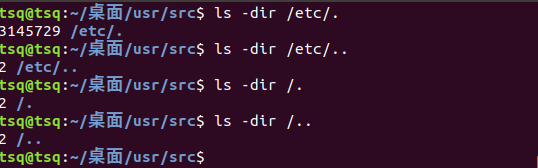

# 第一章：Unix体系结构

**内核**：控制计算机硬件资源，为程序运行提供环境

**系统调用**：内核的接口

**公共函数库**：构建在系统调用上的一个函数库。用户既可以使用公共函数库，也可以使用系统调用接口。


## 文件与目录

### 文件系统

UNIX文件系统是目录和文件的一种层次结构。所有的起点是称为根的目录，该目录的名称为“/”。

### 文件名

Unix中，“/”和“ ”不能出现在文件名中。

创建新目录时，系统自动创建两个文件名："."和".."，分别指向当前目录和父目录。最高层次的目录中，点与点点相同。

### 输入输出

**文件描述符**：文件描述符通常是一个很小的非负整数，内核用以标识一个特定进程正在访问该文件。内核打开或者访问一个文件时他都会返回一个文件描述符。

**标准输入、标注输出、标准错误**：每当运行一个新程序，所有shell都会为其打开三个文件描述符，即标准输入、标注输出、标准错误。

**不带缓冲的I/O**：函数open，read，write，lseek及close都提供了不带缓冲的I/O。

## 程序、进程和线程

**程序**：是一个存储在磁盘上某个目录中的可执行文件。

程序只是一组指令的有序集合，它本身没有任何运行的含义，它只是
 一个静态的实体。

**进程**：程序的执行实例被称为进程。UNIX系统确保每个进程都有一个唯一的数字标识，称为进程ID。

进程则不同，它是程序在**某个数据集上的执行**。进程是**一个动态的实体**，它有自己的**生命周期**。

可以用下列的程序来获取进程ID：

```
#include "apue.h"
int main(void){
	printf("My prosses ID %ld\n",(long)getpid());
	exit(0);
}
```

**线程**：线程共享进程的地址空间、文件描述符、栈及其他属性。

### 头文件apue.h的安装

**apue.h文件简介**：本书中，该文件包含了某些标准系统头文件，定义了许多常量及函数原型。

安装过程：

1. 下载: [src.3e.tar.gz](http://www.apuebook.com/src.3e.tar.gz)
2. 解压: tar xvf src.3e.tar.gz
3. 安装相应库: sudo apt-get install libbsd-dev
4. 进入到apue.3e目录，执行: make
5. cp ./include/apue.h /usr/include/
6. cp ./lib/libapue.a /usr/local/lib/
7. 编译时链接到相应库: gcc -o 1-3 1-3.c -lapue

### 进程控制实例

用于进程控制的主要函数：

1. fork函数：fork函数是用于创建一个子进程，该子进程几乎是父进程的副本，也就是两个进程可以做完全相同的事，但如果初始参数或者传入的变量不同，两个进程也可以做不同的事。fork调用一次，有两次返回，一次在父进程中返回，一次在子进程中返回，返回值供三种：
   1. 在父进程中，fork返回新创建子进程的进程ID；
   2. 子进程中，fork返回0；
   3. 若出现错误，fork返回一个负值。
2. exec函数：exec函数族提供了在一个进程中启动另一个进程的方法，它可以根据的文件名或目录名找到可执行文件，并用它取代原来的调用进程的数据段、代码段和堆栈段。
3. waitpid函数

**实例**：

```
/*
	实现了一个简单的shell
*/
#include "apue.h"
#include <sys/wait.h>
int main(void){
	char buf[MAXLINE];
	pid_t pid;
	int status;
	
	printf("%% ");
	while(fgets(buf,MAXLINE,stdin)!=NULL){
		if(buf[strlen(buf)-1]=='\n'){
			buf[strlen(buf)-1]=0;//把每行的回车更换为0
		}
		if((pid=fork())<0)
			err_sys("fork_error");
		else if(pid==0){
			execlp(buf,buf,(char *)0);
/*0execlp()会从PATH 环境变量所指的目录中查找符合参数file的文件名, 找到后便执行该文件, 然后将第二个以后的参数当做该文件的argv[0]、argv[1]……, 最后一个参数必须用空指针(NULL)作结束。*/
			err_ret("counld't execute: %s", buf);
			exit(127);
		}
		if((pid=waitpid(pid,&status,0))<0)
			err_sys("waitpid error");
		printf("%% ");
	}
	exit(0);
}
```

### 用户标识

**用户ID**：每个用户有一个用户id，用于系统标识。ID为0的用户一般为root用户或者超级用户。

**组ID**：标识用户组

### 信号

信号用于通知进程发生了某种信号。

## 课后习题

1. 在系统上验证除根目录上，.和..是不同的。



