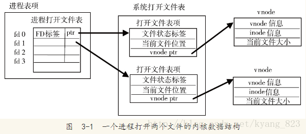
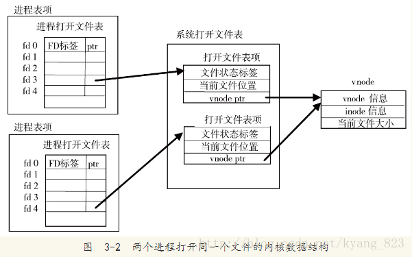
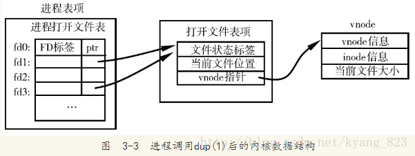

# 第三章：文件I/O

## :star:文件描述符

**文件描述符**：文件描述符通常是一个很小的非负整数，内核用以标识一个特定进程正在访问该文件。内核打开或者访问一个文件时他都会返回一个文件描述符。

1. 标准输入描述符：0，应该用STDIN_FILENO替换

2. 标准输出描述符：1，应该用STDOUT_FILENO替换

3. 标准错误描述符：2，应该用STDERR_FILENO替换

   上述常量都在头文件<unistd.h>定义

**文件描述符位于进程表项**

每个进程为所有打开的文件维护对应的fd flag。当前只定义了一个文件描述符标志：FD_CLOEXEC：若设置某个文件的fd flag（即为1），则进程fork出子进程时，执行exec前要关闭这个文件描述符。

- close_on_exec标志是一个进程所有文件描述符的位图标志，每个比特位代表一个打开的文件描述符，用于确定该打开文件的FD_CLOEXEC状态（1，设置；0，清除）。
- FD_CLOEXEC默认为0，因此默认情况下子进程继承的文件描述符都处于打开状态。（“越权”安全问题）
- 设置某个文件的close on exec标志：fcntl(fd, F_SETFD, flags | FD_CLOEXEC)来进行设置（flags可先通过F_GETFD获得）。

## :star: 文件状态符

**文件状态符位于文件表项**，**不同进程使用同一个文件时共享一个文件状态描述符**

指明文件的状态属性，它们**由open的flags参数指明**。与“文件描述符标志对应进程”不同，文件状态标志**由与同一次打开文件相连的所有重复文件标志符所共享**（涉及dup时，只要共享文件表项即共享fd status flag）。

打开文件的内核数据结构图：







- 一个进程对每个打开文件有各自的文件描述符标志和文件表项（文件状态标志、当前偏移量）。对于fork后， 打开文件相关的结构体struct file， 子进程实际上子拷贝了父进程的指针。所以父子进程的文件偏移值能同步。
- dup时该进程内共享文件表项，即共享文件状态标志和当前偏移量。但dup会清除FD_CLOEXEC标志，因此fork出子进程仍然打开该文件，并拷贝文件表项。
- 继承文件描述符，同时继承文件描述符标志。共享文件表项，即共享文件状态标志和当前偏移量。

## open函数和openat函数

由这两个函数打开的文件返回的文件描述符一定是最小的未使用的文件描述符。

### 函数声明：

```
#include <fcntl.h>
int open(const char* path, int aflag,.../*mode_t mode*/)
int openat(int fd, const char* path, int aflag,.../*mode_t mode*/)
/*
上述两个函数用于打开文件，打开成功返回文件描述符，失败则返回-1
*/
```

### 函数参数说明

path：文件路径或者文件名

aflag：

- 必要参数（有且只有一个）
  - O_RDONLY  只读打开
  - O_WRONLY 只写打开
  - O_RDWR      以读写打开
  - O_EXEC        只执行打开
  - O_SEARCH   只搜索打开（应用于目录）

- 可选参数
  - O_APPEND   追加到文件尾端
  - O_CREAT       若没有此文件则创建此文件
  - 其他选项（UNIX环境高级编程 P-50）

fd参数

fd参数用以区分open文件和openat文件，fd参数共有以下三种可能性

1. path参数指定的是绝对路径名的时候，fd参数被忽略，两个函数相等
2. path参数指定的是相对路径名的时候，fd参数指出了相对路径名在文件系统中开始的地址。fd参数通过打开相对路径名所在的目录来获取。
3. path参数指定的是相对路径名的时候，fd具有特殊值AT_FDCWD.此情况下，路径名在当前工作目录中获取。两个函数在操作上类似。

## creat函数

函数声明：

```
#include <fcntl.h>
int craet(const char* path,mode_t mode);
/*
函数成功则返回文件的描述符，失败则返回-1；
*/
```

该函数的作用等效于：

​		`		open(path,O_WRONLY | O_CREATE | O_TRUNC,mode);`


## close函数

函数声明：

```
#include <unstd.h>
int close(int fd);
/*
若成功返回0，错误返回-1
*/
```

## lseek函数

每个打开的文件都有一个与之相关联的"当前文件偏移量"，它通常是一个非负整数，用以度量从文件开始处计算的字节数。读写操作一般都是从当前文件偏移量处开始的，并使得文件偏移量增加所读写的字节数。按系统默认的情况，当打开一个文件的时候，除非指定了O_APPEND选项，否则偏移量一般都为0。

lseek函数就是设计为显示的为一个打开文件设置偏移量。

文件声明：

```
#include <unstid.h>
off_t lseek(int fd, off_t offset, int whence);
/*
返回值：成功则返回新的文件偏移量，失败则返回-1；
*/
```

参数解释

对offset参数的作用与whence的值有关

- 若whence=SEEK_SET：将该文件的偏移量设置为开始处加offset个字节处
- 若whence=SEEK_CUR：将该文加的偏移量设置为当前值加offset参数，此时offset可以为负数
- 若whence=SEEK_END：将该文加的偏移量设置为文件长度加offset，可正可负

使用方式：

```
off_t curpos;
curpos=lseek(fd,0,SEEK_CUR);
```

lseek函数将文件偏移量记录在内核中，并不进行任何操作，下一次进行读写操作时再使用该偏移量。

值得一提的是，偏移量可以大于当前文件的长度，此情况下，文件的下一次写操作将加长文件长度并在文件中构成一个**空洞**，位于文件中没有被写过的内容都被读为0。 read()调用将会返回0，表示文件结尾。令人惊讶的是，write()函数可以在文件结尾后的任意位置写入数据。

**备注：从原来的文件结尾到新写入数据间的这段空间被成为文件空洞。文件空洞占用任何磁盘空间，直到后续某个时点，在文件空洞中写入了数据，文件系统才会为之分配磁盘块。空洞的存在意味着一个文件名义上的大小可能要比其实际占用的磁盘存储总量要大（有时大出许多）。向文件空洞中写入字节，内核需要为其分配存储单元，即使文件大小不变，系统的可用磁盘空间也将减少。这种情况并不常见，但也需要了解。**

## read函数

函数声明：

```
#include <unstd.h>
ssize_t read(int fd, void* buf , size_t mbytes);
/*
返回值：读成功，则返回读到的字节数，若已经到了末尾，返回0，出错，返回-1；
*/
```

## write函数

函数声明：

```
#include <unstd.h>
ssize_t write(int fd, const void *buf ,size_t mbytes);
/*
返回值：若成功，则返回已经写的字节数，失败则返回-1；
*/
```

write出错的原因通常是：磁盘已满，或者超过了文件长度限制。对于普通文件，写操作从当前偏移量开始，若打开文件时指定了O_APPEND选项，则文件偏移量设置在文件结尾处，再一次成功写之后，文件偏移量增加实际写的字节数。

## I/O效率

练习：利用标准输入输出复制文件

```
#include<apue.h>
#include<fcntl.h>
#define BUFFSIZE 4096

int main(void){
	int n;
	char buf[BUFFSIZE];
	int file_1;
	file = open("t.c",O_RDWR);
	int file_2;
	file_2 = open("x.txt",O_WRONLY);
	while((n=read(file,buf,BUFFSIZE))>0){
		if(write(file2,buf,n)!=n)
			err_sys("write error");
	}
	if(n<0)
		err_sys("read error");
	exit(0);
}
```

## 文件共享

UNIX支持在不同进程间共享打开文件。内核使用3钟数据结构表示打开文件，它们之间的关系决定了在文件共享方面一个进程对另一个进程可能产生的影响。

1. 每个进程在进程表中都有一个记录项，记录项中包含一个文件描述符和一个文件表项指针：
   1. 文件描述符
   2. 文件表项指针：该指针指向文件表中的文件表项
2. 内核为所有打开文件维持一张文件表。每个表项包含：
   1. 文件标识状态
   2. 当前文件的偏移量
   3. 指向该文件v节点表项的指针
3. 每个打开文件都有一个v节点。v节点包含了文件类型和对此文件进行操作的各种指针。对大多数文件，v节点还包含了该文件的i节点（**文件所有者，长度，指向文件实际数据块磁盘所在的指针等等**）。这些信息是在文件打开时从磁盘读入内存的。


不同的进程可以在不同 的文件描述符上打开同一个文件，此时，每个进程都能获得一个该文件的文件表项，但是文件表项内的文件表项指针指向的v节点是同一个。这样的设计是为了使每个进程都有独属于自己的当前偏移量。

lseek函数只修改当前进程下的文件表项内的偏移量，不进行任何I/O操作

## 原子操作

进程表项中，由于拥有文件表项，文件表项又拥有各自的文件描述符和文件偏移量，因此多进程可以正确的读取同一个文件，但当同时写的时候就容易出问题。为了解决这个问题，我们需要了解原子操作

### 问题的发现与提出

在早期的UNIX中，open函数没有O_APPEND选项，追写操作必须先调用lseek设置文件偏移量，再执行写操作。

```
if(lseek(fd,OL,2)<0)//2表示文件尾
	err_sys("lseek error");
if(write(fd,buf,100)!=100)
	err_sys("write error");
```

对单个进程而言，能正确执行写操作。但当有两个进程执行写操作时，就会出现问题。假设文件长度为233，进程1先设置偏移量为233，然后内核切换进程，进程2也设置了偏移量为233，然后进程2执行写操作，内核再次切换，进程1开始执行写操作，但由于进程1的文件偏移量还是233，就会导致进程2写的内容被进程1覆盖。

问题出在逻辑操作“先调用lseek设置文件偏移量，再执行写操作。”，它使用了两个分开的函数。解决问题的方法就在于把两个操作合二为一成为一个原子操作。

UNIX系统提供了一个在open操作时的选项O_APPEND来执行这种原子操作方法。这使得进程在写之前都自动设定偏移量，而不是调用lseek函数。

### 函数pread和pwrite

函数定义：

```
#include <unstd.h>
ssize_t pread(int fd , void* buf , size_t bytes , off_t offset);
/*
返回值：成功则返回读到的字节数，若文件已经到文件尾，则返回0，错误则返回-1；
*/
ssize_t pwrite(int fd ,  const void* buf , size_t bytes , off_t offset);
/*
返回值：成功则返回已写的字节数，出错则返回-1；
*/
```

参数说明：

- *fd*：文件标识符
- **buf*：存放读出存取数据的缓冲区
- *bytes*：要读取的字节数
- *offset*：文件指针

函数作用：

- pread：从打开文件的指定位置，调用pread相当于先调用lseek，再调用read。但与之不同的是：
  - 调用pread，并不会中断其定位和读操作
  - 不更新当前偏移量
- pwrite：调用pwrite，相当于先调用lsee再调用write操作。

**原子操作指的是多个步骤组成的一个操作。若该原子操作执行，则要么执行完毕，要么不执行。**

### 函数dup和dup2

函数描述：

```
#include <unstd.h>
int dup(int oldfd);
int dup2(int oldfd , int newfd2 );
/*
函数的返回值：
若成功则返回新的函数描述符，失败则返回-1；
*/
```

**由dup函数返回的文件描述符一定是当前可用的最小文件描述符，该新文件描述符指向oldfd拥有的文件表项。**，而对dup2，则可以用第二个参数**newfd2**来指定参数的新描述符。如果newfd2已经打开，dup2函数会先关闭它，若oldfd=newfd2，则返回fd2，并且不关闭它。反之，fd!=fd2时，该文件描述符的FD_CLOEXEC标志位会被清楚，这样进程再调用exec时是打开状态。

此时返回的新文件描述符与原有的文件描述符共享一个文件表项。

以下两个函数是相等的：

```
dup(fd);
fcntl(fd, F_DUPFD, 0);
```

以下两个函数是相等的：

```
dup2(fd, fd2);

close(fd2);//先关闭fd2
fcntl(fd, F_DUPFD, fd2);
```

尤为需要记住的是，最后两个函数并不是完全相等的，具体区别如下：

- dup2是一个原子函数，而后者是两个函数的调用，可能在两个函数之间还可能调用了其他函数该表了文件描述符。

## 函数sync、fsnyc和fdatasync

延迟写：当数据写入文件时，内核先将文件传入高速缓冲区。如果缓冲区还没满，则不将其排入输出队列，而是等待将其写满或者当需要内核重用该缓冲区以便存放其他磁盘块数据时，再将该缓冲写入输出队列，待其到达队首时再将进行实际的I/O操作。

**延时写减缓了磁盘读写次数，但是却降低了文件内容的更新速度，使得想要写入磁盘的文件没有及时写入，当系统发生故障时，这种延迟可能造成文件更新内容的缺失**，为了保持实际文件系统与高速缓冲区中内容的一致性，系统提供了上述三个函数。

函数声明：

```
#include <unstd.h>
int fsync(int fd);
int fdatasync(int fd);
/*
返回值：若成功则返回0；失败返回-1
*/
```

sync函数

- 此函数将所有修改过的块缓冲区排入写队列，然后就返回，它不等实际写磁盘操作结束。
- 通常称为update的系统守护进程会周期性地（一般每隔30秒）调用sync函数。这就保证了定期冲洗内核的块缓冲区。命令sync(1)也调用sync函数。

fsync函数

- 对文件描述符filedes指定的单一起文件作用，**并且等待写磁盘操作结束**，然后返回。
- 可以用于数据库这样的应用程序，这种程序要确保修改过的块立即写到磁盘上。
- 同时，fsync还会更新文件的属性

fdatasync函数

- 此函数与fsync相似，**只不过不更新文件的属性**。

## fcntl函数

函数声明：

```
#include <fcntl.h>

int fcntl(int fd, int cmd);
int fcntl(int fd, int cmd, long arg);
int fcntl(int fd, int cmd, struct flock *lock);
/*
返回值：成功则依赖于cmd，失败则返回-1；
*/
```

参数说明：

- *fd*：文件描述符
- *cmd*：操作命令
- *arg*：供命令使用的参数
- *lock*：供命令使用的参数

函数功能：

- 复制一个已有的描述符：cmd=F_DUPFD或F_DUPFD_CLOEXECF_DUPFD_CLOEXEC
- 读取/设置文件描述符：cmd=F_GETFD或F_SETFD
- 获取/设置文件状态符：cmd=F_GETFL或F_SETFL
- 获取/设置文件I/O所有权：cmd=F_GETOWN或F_SETOWN
- 获取/设置文件记录锁：cmd=F_GETLK、F_SETLK或F_SETLKW

八种cmd:

```
8种cmd：

 1. F_DUPFD：复制文件描述符fd。新文件描述符作为函数值返回。它是尚未打开的各描述符中大雨或等于第3个参数值(取为整型值)中各值的最小值。
 2. F_DUPFD_CLOEXEC：复制文件描述符，设置与新描述符关联的FD_CLOEXEC文件描述符标志的值，返回新文件描述符。
 3. FD_GETFD：对应于fd的文件描述符标志作为函数返回。当前只定义了一个文件描述符标志FD_CLOEXEC。
 4. FD_SETFD：对应于fd设置文件描述符标志。新标志值按第3个参数（取为整型值）设置。
 5. F_GETFL：对应于fd的文件状态标志作为函数值返回。
     O_RDONLY         只读打开
     O_WRONLY         只写打开
     O_RDWR           读、写打开
     O_EXEC           只执行打开
     O_SEARCH         只搜索打开目录
     O_APPEND         追加写
     O_NONBLOCK       非阻塞模式
     O_SYNC           等待写完成（数据和属性）
     O_DSYNC          等待写完成（仅数据）
     O_RSYNC          同步读和写
     O_FSYNC          等待写完成（仅FreeBD和Mac OS X）
     O_ASYNC          异步I/O（仅FreeBD和Mac OS X）
 6. F_SETFL：将文件状态标志设置为第3个参数的值（取为整型值）。可以更改的几个标志是：O_APPEND、O_NONBLOCK、O_SYNC、O_DSYNC、O_RSYNC、O_FSYNC和O_ASYNC
 7. F_GETOWN：获取当前接收SIGIO和SIGURG信号和进程ID或进程组ID。
 8. F_SETOWN：设置接收SIGIO和SIGURG信号的进程ID和进程组ID。正的arg指定一个进程ID，负的arg表示等于arg绝对值的一个进程组ID。
```

对于F_GETFL的深入理解：

该参数以fd文件状态标识作为返回值，在描述open函数的时候已经描述过文件状态标识。五个访问标识：

```
O_RDONLY  只读打开
O_WRONLY  只写打开
O_RDWR    以读写打开
O_EXEC    只执行打开
O_SEARCH  只搜索打开（应用于目录）
```

并不各占一位，前三个的值分别为0，1，2.这5个值互斥，一个文件的访问方式只能取五个之一。因此在获得的函数返回值后，必须先与屏蔽字O_ACCMODE相与才能取得访问方式位，并以与上述五个值比较才能确定到底是哪一个访问标识。

实例3-11：

程序的第一个参数指定文件描述符，并对该描述符打印所选择的文件标识进行说明

```
#include "apue.h"
#include <fcntl.h>

int main(int argc, char *argv[])
{
    int val;

    if (argc != 2)
        err_quit("usage: a.out <descriptor#>");

    if ((val = fcntl(atoi(argv[1]), F_GETFL, 0)) < 0)
        err_sys("fcntl error for fd %d", atoi(argv[1]));

    switch (val&O_ACCMODE) {
    case O_RDONLY:
        printf("read only");
        break;

    case O_WRONLY:
        printf("write only");
        break;

    case O_RDWR:
        printf("read write");
        break;

    default:
        err_dump("unkown access mode");
    }

    if(val & O_APPEND)
        printf(", append");
    if(val & O_NONBLOCK)
        printf(", nonblocking");
    if(val & O_SYNC)
        printf(", synchronous writes");

#if !defined(_POSIX_C_SOURCE) && defined(O_FSYNC) && (O_FSYNC != O_SYNC)
    if (val & O_FSYNC)
        printf(", synchronous writes");
#endif

    putchar('\n');
    exit(0);
}
```

运行实例：


实例3-12 设置一个文件描述符开启多个文件状态符

需要注意的是，修改文件状态符的时候，要先获取当前的状态值，再按期望修改。不能只执行F_SETFD或F_SETFL，这样会关闭以前设置的 标识。

```
#include "apue.h"
#include <fcntl.h>
void set_fl(int fd , int flags){
	int val;
	if((val=fcntl(fd,F_GETFL,0))<0)
		err_sys("F_GETFL ERROR ");
	val |= flags;//设置新的文件状态符号
	if(fcntl(fd , F_SETFL , val)<0)
		err_sys("F_SETFL ERROR");
}

int main(){
	int fd;
	int fl;
	
	if((fd=open("test.file",O_RDWR))==-1)
		err_sys("Open file error!");
		
	if((fl=fcntl(fd,F_GETFL,0))<0)
		err_sys("F_GETFL ERROR ");
		
	printf("The old fl:%d",fl);
	
	set_fl(fd , O_RDONLY);
	
	if((fl=fcntl(fd,F_GETFL,0))<0)
		err_sys("F_GETFL ERROR ");
		
	printf("The new fl:%d",fl);
	
	return 0;
}
```

